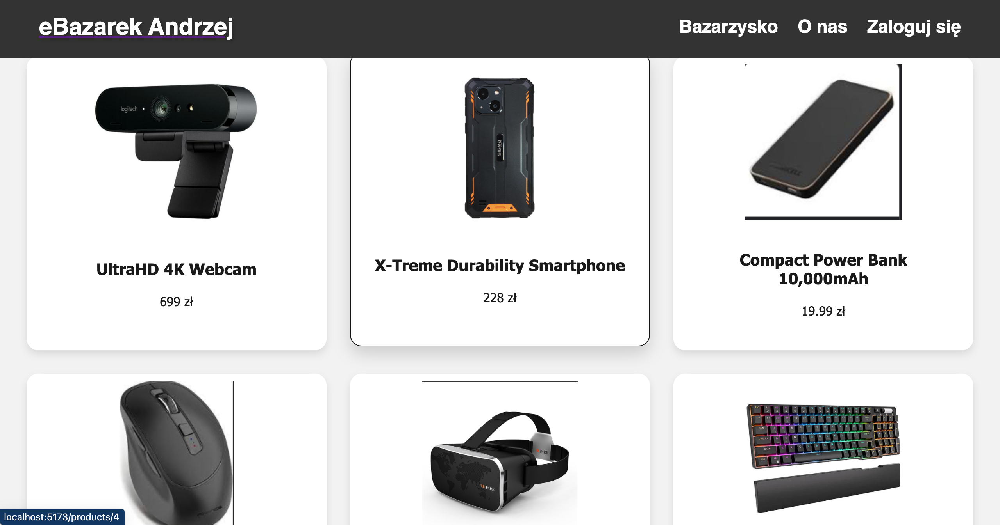
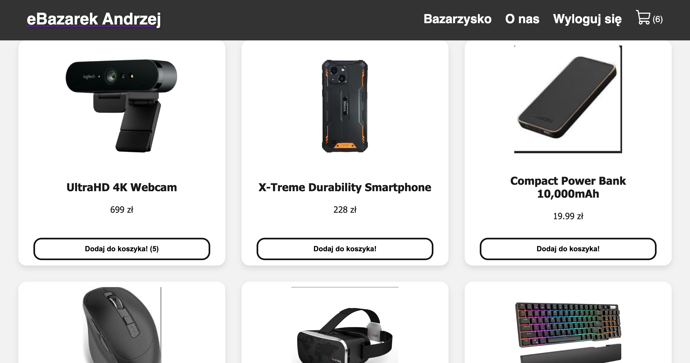
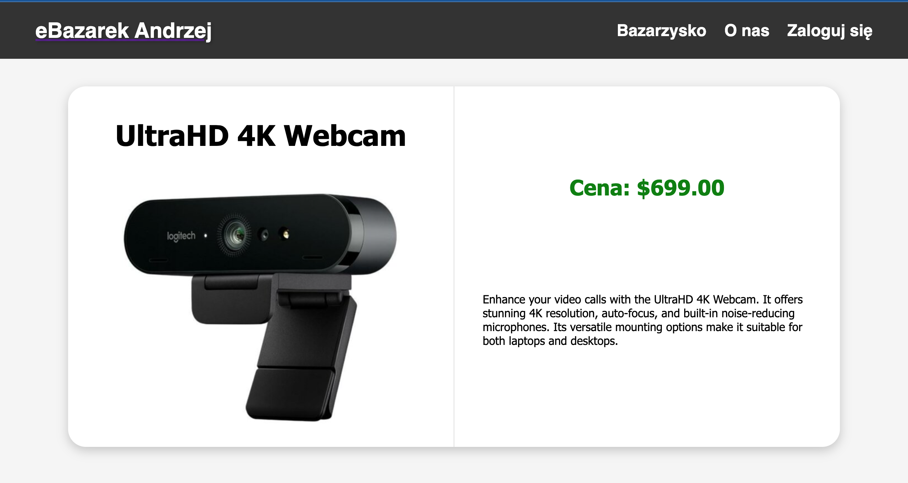
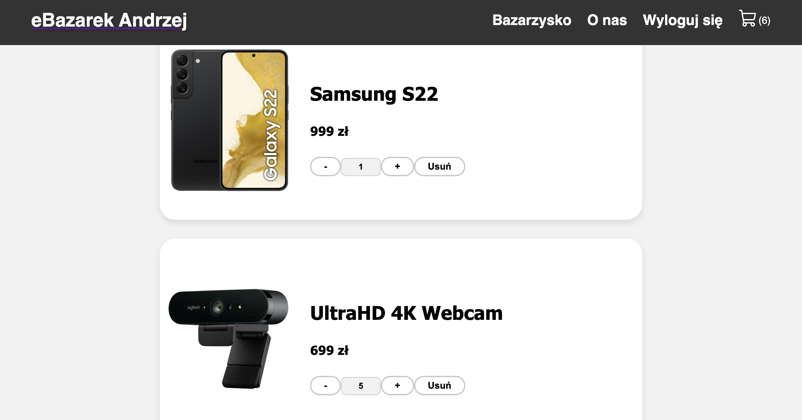
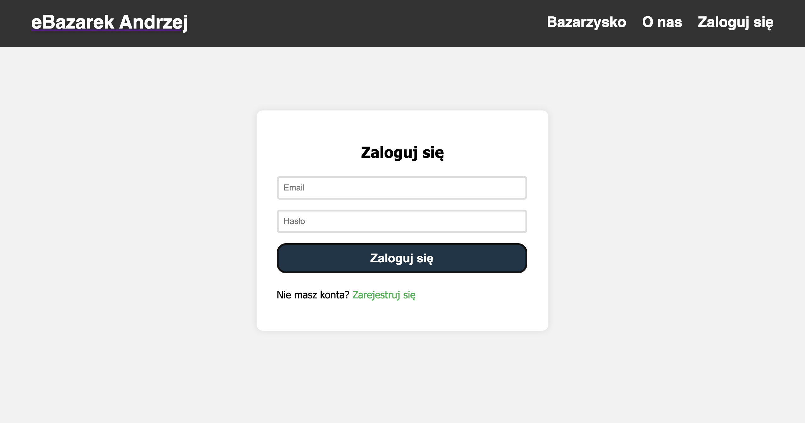

### 📝 Opis:

Projekt ten jest sklepem internetowym, który umożliwia użytkownikom przeglądanie i zakup produktów online. W sklepie dostępne są różnorodne produkty, a użytkownicy mogą dodawać je do koszyka, dokonywać zakupów, a także zarejestrować się lub zalogować się do swojego konta.

### 🖼️ Zdjęcia:

Poniżej znajdują się zrzuty ekranu prezentujące działanie aplikacji:

1. Ekran główny sklepu:

   - przed zalogowaniem

   

   - po zalogowaniu

   

2. Strona produktu:

   

3. Koszyk zakupów:

   

4. Formularz logowania:

   

5. Formularz rejestracji:

   

### 🧾 Instrukcja obsługi:

1. **Przeglądanie Produktów:**

   - Na ekranie głównym sklepu znajdują się różnorodne produkty. Użytkownicy mogą przeglądać je i kliknąć na interesujący produkt, aby uzyskać więcej informacji.

2. **Dodawanie Produktów do Koszyka:**

   - Po wybraniu produktu, użytkownicy mogą dodać go do koszyka za pomocą przycisku "Dodaj do koszyka". Niezalogowani użytkownicy zostaną poproszeni o zalogowanie się przed dodaniem produktu do koszyka.

3. **Logowanie/Rejestracja:**

   - Użytkownicy mogą zalogować się lub zarejestrować nowe konto, aby móc dokonywać zakupów. Formularze logowania i rejestracji są dostępne na stronie głównej.

4. **Zakup Produktów:**
   - Po dodaniu produktów do koszyka, użytkownicy mogą przejść do kasy, gdzie dokonają płatności za zakupy.

### 👨‍💻 Autorzy:

Projekt został stworzony przez trzy osoby:

1. Szymon Kubiczek
2. Wiktor Dybalski
3. Bartlomiej Szubiak
